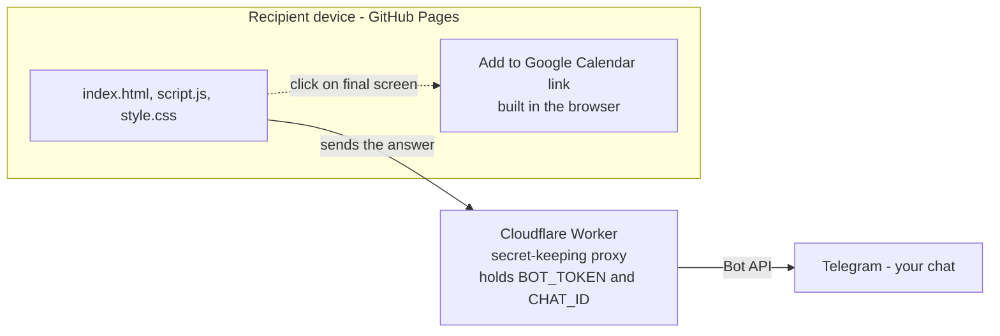

# Date Night 💕

A playful, single-page "Will you go on a date with me?" invitation. The recipient
picks an activity, food, date/time, and an excitement level — and when they hit send,
**you** get a Telegram message with their answers, and they get a one-click
"Add to Google Calendar" button.

- **Live site:** `https://<YOUR_USERNAME>.github.io/<YOUR_REPO>/`
- **Stack:** plain HTML + CSS + JavaScript (no framework, no build step)

---

## How it works (architecture)



Two separate pieces, two jobs:

- **GitHub Pages** – hosts the static page (what the recipient opens).
- **Cloudflare Worker** – a tiny serverless script that holds your Telegram bot
  token *secretly* and forwards the answer to your Telegram. This exists **only**
  so the token never appears in the public page source.

Google Calendar needs **no** setup — the final screen just builds a
`calendar.google.com/render?...` link the recipient can click to save the event.

---

## Project structure

| File | What it is |
|------|------------|
| `index.html` | Page markup + all the screen templates (`<template>` blocks) |
| `script.js`  | All logic: screen flow, the dodging "NO" button, Telegram send, calendar link, activity/food/emoji data |
| `style.css`  | Styling + the pink color palette (CSS variables) |
| `worker.js`  | The Cloudflare Worker code — **not served by the site**; you paste it into Cloudflare (see below) |

---

## Setup — reproduce from scratch

### 1. Create a Telegram bot

1. In Telegram, search **`@BotFather`**, press **Start**, send `/newbot`.
2. Give it a name, then a username ending in `bot` (e.g. `my_date_bot`).
3. BotFather replies with an **HTTP API token** like `123456789:AA...`. Keep it private.
4. Open your new bot and press **Start** (so it's allowed to message you).
5. Get **your personal chat ID**: message **`@userinfobot`** — it replies with your
   numeric ID (e.g. `96914393`).
   ⚠️ This is **your** ID, *not* the bot's ID (the bot's ID is the number before the
   `:` in the token — don't use that).
6. (Optional) Test the token + chat ID in a browser:
   `https://api.telegram.org/bot<YOUR_BOT_TOKEN>/sendMessage?chat_id=<YOUR_CHAT_ID>&text=hi`
   If you get "hi" in Telegram, it works.

### 2. Create the Cloudflare Worker (keeps your token secret)

1. Go to [dash.cloudflare.com](https://dash.cloudflare.com) → **Workers & Pages** →
   **Create** → **Create Worker** → **Start with Hello World!** → name it → **Deploy**.
2. Click **Edit code**, delete the sample, paste the entire contents of
   [`worker.js`](worker.js), then **Deploy**.
3. In the Worker's **Settings → Variables and Secrets**, add two variables and mark
   each as **Secret / Encrypt**:
   | Name | Value |
   |------|-------|
   | `BOT_TOKEN` | your bot token from step 1 |
   | `CHAT_ID`   | your personal chat ID from step 1 |
   Then **Deploy** again so the variables take effect.
4. Copy the Worker's URL, e.g. `https://<name>.<subdomain>.workers.dev`.

> The token and chat ID live **only** inside Cloudflare — never in this repo or the
> public page.

### 3. Point the site at your Worker

In [`script.js`](script.js), set the `workerURL` constant (in `TelegramService.sendPayload`)
to your Worker URL:

```js
const workerURL = "https://<name>.<subdomain>.workers.dev/";
```

Test locally (see *Running locally*), complete the flow, and confirm you receive the
Telegram message.

### 4. Host it on GitHub Pages

1. Create an empty repo on GitHub and push this folder to it (see *Deploying updates*).
2. Repo **Settings → Pages → Source: Deploy from a branch → `main` / `root` → Save**.
3. ~1 minute later it's live at `https://<YOUR_USERNAME>.github.io/<YOUR_REPO>/`.
   Send **that** link.

> You can have this **and** a personal portfolio site on one account — every account
> gets one `username.github.io` site plus unlimited `username.github.io/<repo>`
> project sites (this is a project site).

### Google Calendar — no setup

The final screen's **📅 Add to Google Calendar** button is generated in the browser
(`buildCalendarLink` in `script.js`). It pre-fills a 2-hour event with the chosen
activity, food, notes, and `Kingston, Ontario` as the location. Nothing to configure.

---

## Running locally

From this folder:

```bash
python -m http.server 8123
```

Then open <http://localhost:8123/>. (Any static file server works.)
Note: the Telegram send only works once `workerURL` points at a deployed Worker.

---

## Deploying updates

GitHub Pages redeploys automatically on every push to `main`:

```bash
git add .
git commit -m "your message"
git push
```

Then hard-refresh the live page (Ctrl/Cmd + Shift + R) to bypass the cache.

---

## Customizing

### Activities
Edit the tiles in `index.html` under `#activity-grid`. Each tile:

```html
<button class="grid-btn" data-ekey="coffee" data-value="Coffee + Walk ☕">
  <span class="tile-emoji">☕🥐</span><span class="tile-label">Coffee</span>
</button>
```

- `data-ekey` links to the emoji-rain theme and preset list (below).
- `data-value` is the full text pre-filled on the "tweak the details" step.
- `data-ekey="dinner"` is special — it routes to the food picker.
- Two `.special-btn` tiles are the "who plans it" options.

Then in `script.js`:
- `ACTIVITY_EMOJIS` – the falling-emoji set for each `data-ekey`.
- `ACTIVITY_PRESETS` – the "vibe" suggestions shown on the details step for each `data-ekey`.

Keep the grid a multiple of 3 tiles so it stays symmetrical (3 columns).

### Food (cuisines & dishes)
Edit the `CUISINES` array in `script.js`. Each entry has a `name`, an `emoji`, and a
`dishes` list of `{ e: emoji, n: name }`.

### Colors (pink palette)
All colors come from CSS variables at the top of `style.css`:
`--pink-50` (lightest, page background) → `--pink-900` (darkest). Change these to
re-theme the whole site.

### Emojis look different per device — that's normal
The page uses each device's **native** emoji font: an iPhone/Mac shows Apple-style
emojis, Windows shows Microsoft's, Android shows Google's. This is intentional — the
recipient sees their own OS's emojis. (There's no legal way to force Apple emojis on
other devices, and adding an emoji-image library would *override* the nice Apple ones
on an iPhone.)

---

## Personalized links & location

- **Tag who you send it to** — append `?to=Name` to the link, e.g.
  `https://<user>.github.io/<repo>/?to=Sarah`. The page then greets them by name
  ("Sarah, will you go on a date with me?"), sets the tab title, and includes
  **`👤 Invited: Sarah`** in your Telegram message. Without `?to=`, everything works
  as a generic invite. (Parsed in `parseRecipient()` in `script.js`.)
- **Approximate location** — the Cloudflare Worker adds the visitor's approximate
  **city / region / country**, postal code, a Google Maps pin, and IP to the Telegram
  message, using Cloudflare's built-in `request.cf` geo. This is **city-level, not a
  precise neighborhood**, and requires re-deploying `worker.js` in Cloudflare after
  changes.

## Auto-add to your Google Calendar (optional)

When enabled, the Worker creates the date on **your** Google Calendar automatically the
moment she submits (in addition to Telegram) — no taps from anyone. It's optional: if the
Google secrets below aren't set, the Worker just skips this step.

Set these extra secrets on the Worker (Settings → Variables and Secrets), then paste the
latest [`worker.js`](worker.js) and Deploy:

| Secret | From |
|--------|------|
| `GOOGLE_CLIENT_ID` | Google Cloud Console → OAuth client |
| `GOOGLE_CLIENT_SECRET` | Google Cloud Console → OAuth client |
| `GOOGLE_REFRESH_TOKEN` | OAuth Playground (one-time authorization) |
| `EVENT_TIMEZONE` | optional, defaults to `America/Toronto` |

One-time setup:
1. **console.cloud.google.com** → create a project → **APIs & Services → Library** →
   enable **Google Calendar API**.
2. **OAuth consent screen** → External → add your email + the
   `.../auth/calendar.events` scope → add yourself as a **Test user** → **Publish app**
   (production, so the refresh token doesn't expire after 7 days).
3. **Credentials → Create OAuth client ID → Web application** → add redirect URI
   `https://developers.google.com/oauthplayground` → copy the Client ID + Secret.
4. **developers.google.com/oauthplayground** → gear icon → *Use your own OAuth
   credentials* → paste ID + Secret. In Step 1 enter scope
   `https://www.googleapis.com/auth/calendar.events` → Authorize → sign in → Step 2
   *Exchange authorization code for tokens* → copy the **refresh token**.
5. Put the three values into the Worker secrets, paste `worker.js`, Deploy.

The event lands on your `primary` calendar, titled from `evTitle` (e.g. `Date with Diana ❤️`).

## Notes

- **Secrets** (bot token, chat ID) live only in Cloudflare — never commit them.
- The Telegram message includes some device info (browser, OS, screen, timezone, etc.)
  gathered in `SystemDetector`; trim that in `script.js` if you'd rather not send it.
- Date picker blocks past dates; if "today" is chosen, only future times are selectable.
